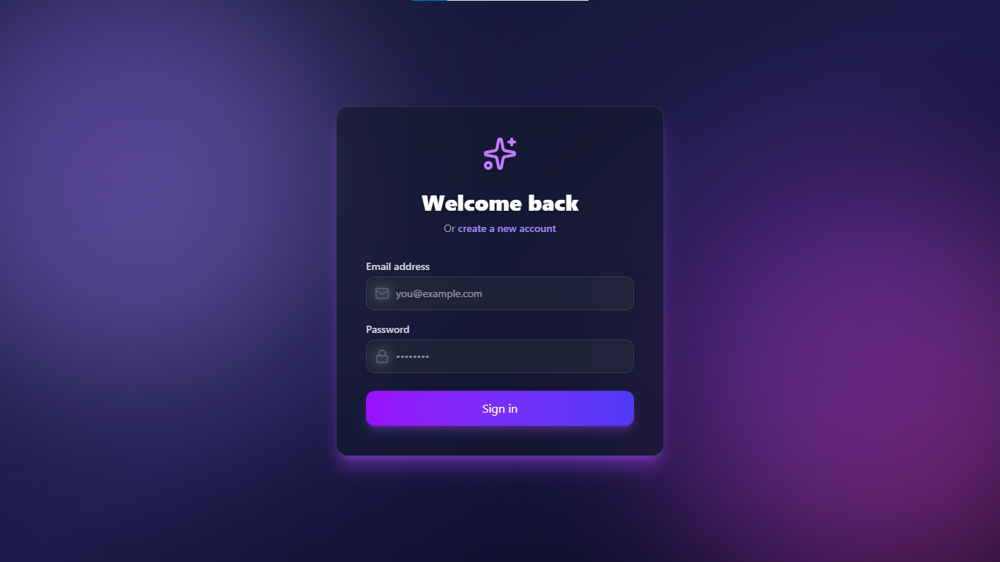
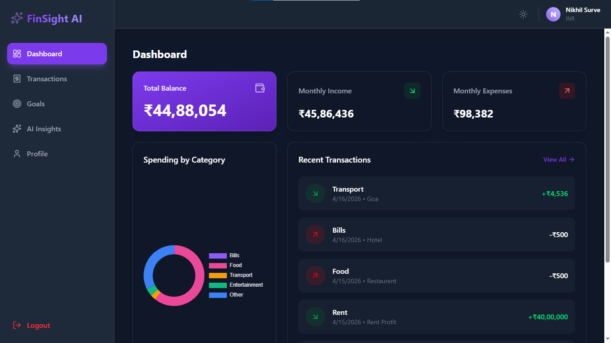
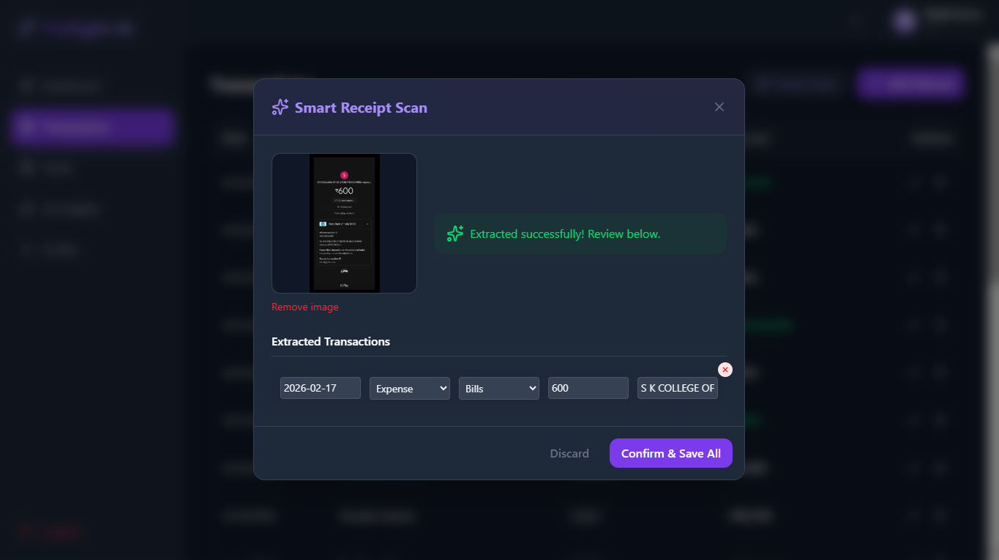
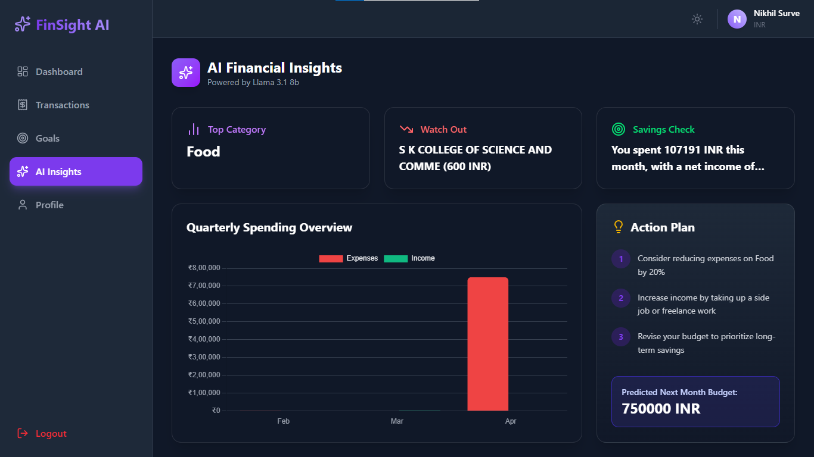
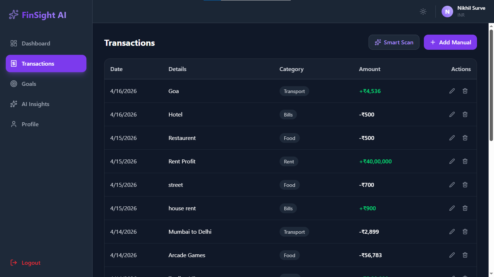
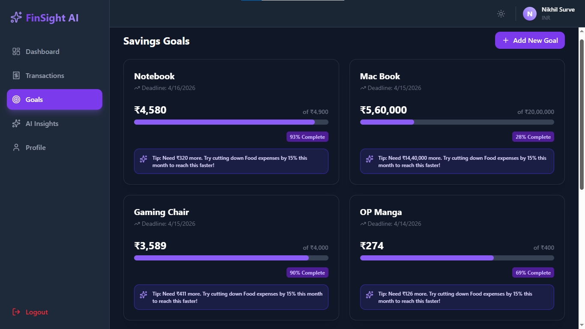

# 🚀 FinSight AI - Smart Personal Finance Tracker

<div align="center">

[](https://opensource.org/licenses/MIT)
[](https://nodejs.org/)
[](https://react.dev/)
[](https://tailwindcss.com/)
[](https://openrouter.ai/)

**Transforming the way you track, analyze, and optimize your finances with the power of AI.**

[Explore Features](#-key-features) • [Installation](#-installation-guide) • [Tech Stack](#-tech-stack) • [Project Structure](#-project-structure)

</div>

---

## 📸 Screenshots

| Login (Dark Mode) | Dashboard Overview |
| :---: | :---: |
|  |  |

| Smart Receipt Scan | AI Insights |
| :---: | :---: |
|  |  |

| Transactions | Goals Tracking |
| :---: | :---: |
|  |  |

> [!TIP]
> **Mobile Ready**: FinSight AI is fully responsive. Check out the [Mobile View](assets/screenshots/mobile-view.png).

---

## ✨ Key Features

- **💳 Smart Receipt Scan**: Don't waste time typing. Upload a receipt or a payment screenshot, and our AI (via Gemini 2.0 Flash) will automatically parse the merchant, date, amount, and category for you.
- **📊 Interactive Dashboard**: Visualize your spending habits with dynamic charts powered by Chart.js. Track income vs. expenses at a glance.
- **🤖 AI Financial Insights**: Receive personalized financial advice and monthly spending analysis generated by Llama 3, helping you make smarter money decisions.
- **🎯 Goals Management**: Set and track your savings goals with real-time progress bars and motivational tips.
- **💱 Global Currency**: Seamlessly switch between INR, USD, and GBP. The entire UI updates exchange rates in real-time.
- **🌓 Modern UI/UX**: Built with Tailwind CSS 4, featuring a sleek Dark Mode, smooth transitions, and a premium "glassmorphism" aesthetic.
- **🔒 Secure Auth**: Full JWT-based authentication system ensuring your financial data remains private and secure.

---

## 🛠️ Tech Stack

### Frontend
- **Framework**: React 19 + Vite
- **Styling**: Tailwind CSS 4
- **State/Routing**: React Router 7, Context API
- **Charts**: Chart.js + React-Chartjs-2
- **Icons**: Lucide React

### Backend
- **Runtime**: Node.js
- **Framework**: Express.js 5
- **Database**: MongoDB (Mongoose)
- **File Uploads**: Multer
- **Auth**: JSON Web Tokens (JWT) + Bcrypt

### AI Infrastructure
- **OpenRouter API**:
  - **Vision**: Gemini 2.0 Flash (for Receipt Scanning)
  - **Analysis**: Llama-3.1-8B (for Financial Insights)

---

## 📂 Project Structure

```text
finsight-ai/
├── client/                 # Frontend (React + Vite)
│   ├── src/
│   │   ├── components/     # Reusable UI components
│   │   ├── context/        # Auth & Theme context
│   │   ├── pages/          # Page-level components
│   │   ├── utils/          # API helpers & formatters
│   │   └── App.jsx
│   └── tailwind.config.js
├── server/                 # Backend (Node.js + Express)
│   ├── controllers/        # Request handlers
│   ├── middleware/         # Auth & Error handling
│   ├── models/             # Mongoose schemas
│   ├── routes/             # API endpoints
│   ├── utils/              # AI (OpenRouter) & Helpers
│   └── server.js
├── assets/                 # Brand assets & screenshots
│   └── screenshots/        # Portfolio images
└── .gitignore              # Root-level ignore rules
```

---

## 🚀 Installation Guide

### Prerequisites
- [Node.js](https://nodejs.org/) (v18 or higher)
- [MongoDB](https://www.mongodb.com/) (Local or Atlas)
- [OpenRouter API Key](https://openrouter.ai/)

### 1. Clone the repository
```bash
git clone https://github.com/yourusername/finsight-ai.git
cd finsight-ai
```

### 2. Setup Server
```bash
cd server
npm install
```
Create a `.env` file in the `server` folder based on `.env.example`:
```env
PORT=5000
MONGODB_URI=your_mongodb_connection_string
JWT_SECRET=your_jwt_secret_key
OPENROUTER_API_KEY=your_openrouter_api_key
```

### 3. Setup Client
```bash
cd ../client
npm install
```

### 4. Run the Application
Start the backend (from `server` folder):
```bash
npm run dev
```
Start the frontend (from `client` folder):
```bash
npm run dev
```

---

## 🌐 Deployment

### Backend (Render/Heroku)
- Set Environment Variables in the dashboard.
- Update `MONGODB_URI` to use MongoDB Atlas.

### Frontend (Vercel/Netlify)
- Set `VITE_API_URL` to point to your deployed backend.
- Run `npm run build`.

---

## 🤝 Contributing

Contributions are what make the open source community such an amazing place to learn, inspire, and create. Any contributions you make are **greatly appreciated**.

1. Fork the Project
2. Create your Feature Branch (`git checkout -b feature/AmazingFeature`)
3. Commit your Changes (`git commit -m 'Add some AmazingFeature'`)
4. Push to the Branch (`git push origin feature/AmazingFeature`)
5. Open a Pull Request

---

## 📄 License

Distributed under the MIT License. See `LICENSE` for more information.

---

## 👤 Author

**FinSight AI** - Developed with ❤️ by [Your Name](https://github.com/yourusername)

---

<div align="center">
  <sub>Built with the MERN Stack and OpenRouter AI.</sub>
</div>
